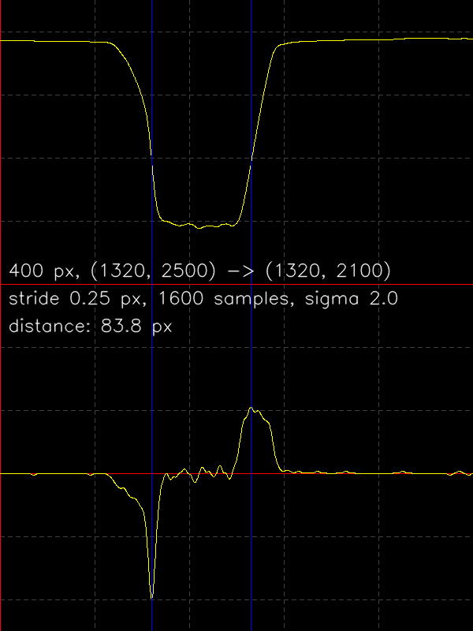
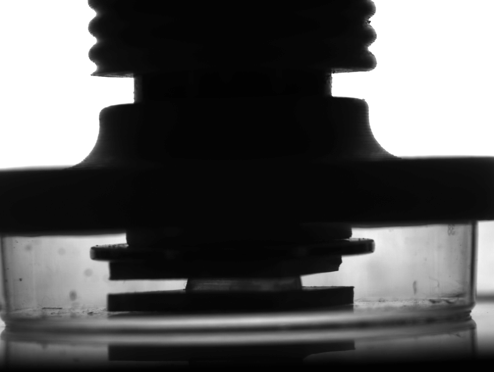

# metrology demo

this is a "quick and dirty" concept sketch.

concepts/steps:
- load picture
- ensure "object" is white, background is black (maybe invert picture)
- define a line to sample along
- sample picture along line to get a 1-D signal
- possibly lowpass filter against pixel noise
- calculate gradient
- find locations of maximum and minimum in gradient (argmax, argmin)
- difference is distance

## metrology

can be taken a lot more seriously than I do here, in terms of precision, usage
of units, calibration, ...

it's basically "counting pixels". lots of low level image processing and
geometric calculations.

some industrially known libraries are Cognex "VisionPro" and MVTec "HALCON".
they were made for "counting pixels" and user friendliness but they grow to
include Deep Learning too now, inference at least.

OpenCV has nearly no "easy to use" procedures for this purpose. It wasn't made
for this. it was made for computer vision, a loftier goal. maybe it's a good
idea to give opencv a metrology module that provides easy to use procedures for
the things I do here (and more).

## sampling along a line

- two points define the line
- calculate coordinates along that line
  - equally spaced points (along X axis)
  - affine transformation to map them onto the line
- use some interpolation scheme (nearest neighbor, linear, cubic, higher order)
  to sample the input image on those points

## to find edges

... there's one approach with two flavors, depending on how smooth your signal
is: you basically have to find large changes in the signal's level.

you could threshold the signal. then all changes are of the same magnitude:
1 (binary). easy to find those.

or you could deal with the signal as is. then you calculate a "gradient". then
you have to find where the gradient is large:

- either "relatively" large, so you find the largest gradient
- or absolutely "large enough", where you may get multiple adjacent points
  (hence ambiguity) that satisfy the condition

## what does it look like

there's this petri dish. it contains two plates with a translucent glob between
them. we need to know how far apart these plates are.  the plates will move
vertically.

to determine the distance, we're interested in the top edge of the lower plate
and the bottom edge of the upper plate. we define a line that spans both edges
comfortably. the rest happens as described above.

screenshot shows samples along line (top) and gradient (bottom):

input picture (not my own picture):

